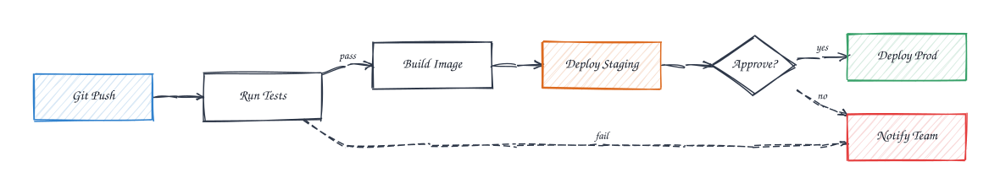
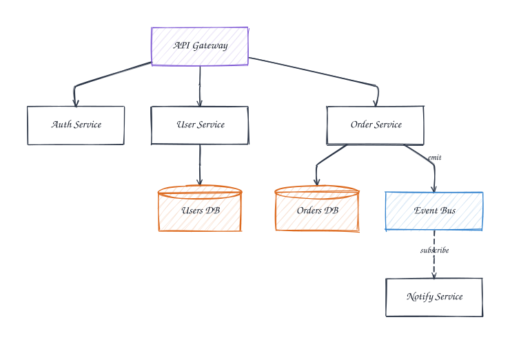
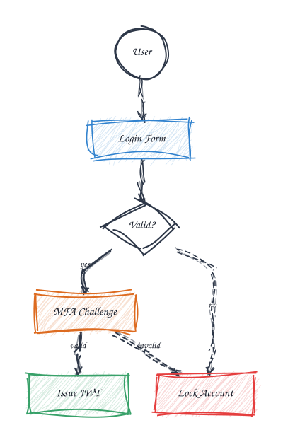
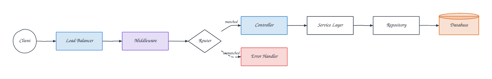
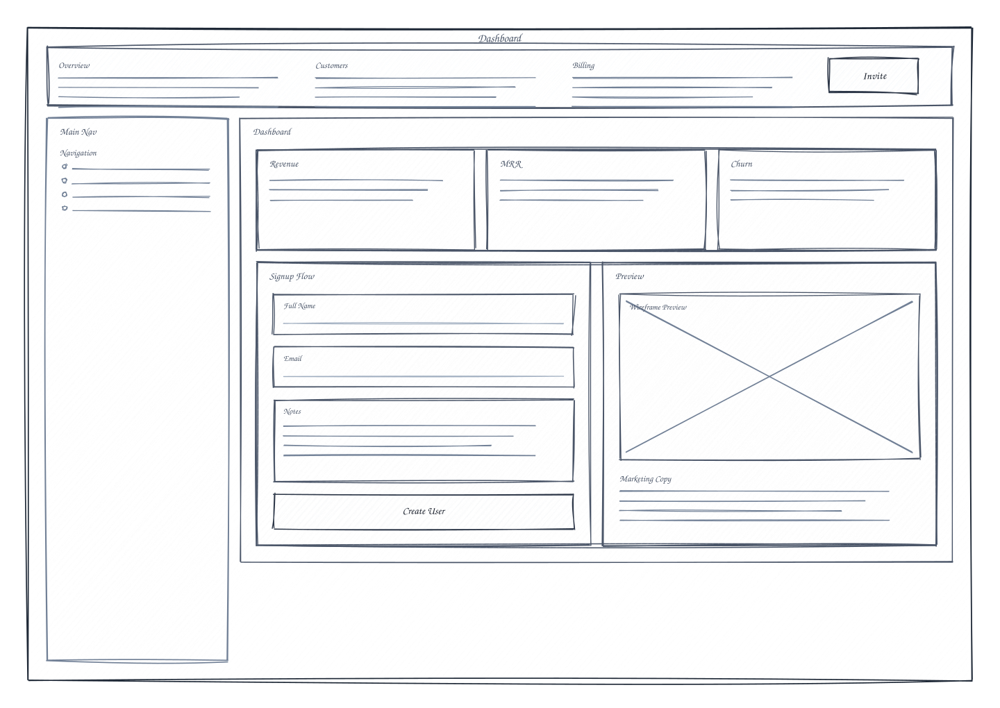
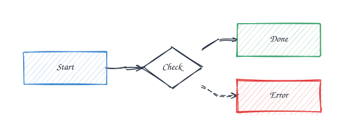
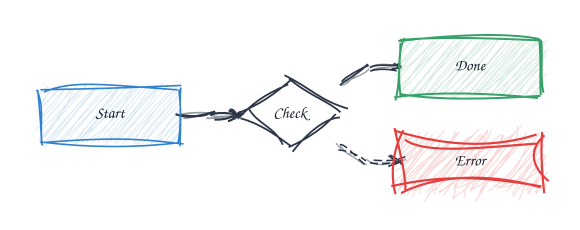
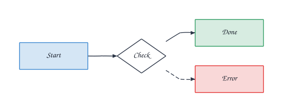
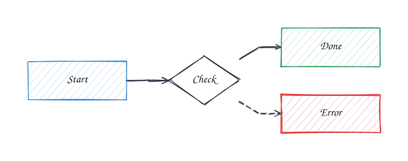
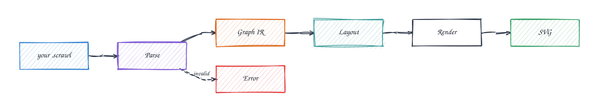

# scrawl

[](https://www.npmjs.com/package/scrawl-core)
[](LICENSE)

> Hand-drawn diagrams from plain text. 57% fewer tokens than Mermaid.

Scrawl is a compact, line-oriented diagram format that renders to hand-drawn SVGs. Designed for LLM generation, documentation, and anywhere you want diagrams that feel human.

Version `0.3.0` adds bent wireframe routes, midpoint-aware labels, and hand-drawn style controls across the CLI and web app.

## Why scrawl?

```
lr                                          flowchart LR
push(Git Push)~blue->ci(Run Tests)            push[Git Push]:::blue --> ci[Run Tests]
ci->build(Build)|pass                         ci -->|pass| build[Build Image]
ci=>fail(Notify)~red|fail                     ci -.->|fail| fail[Notify]:::red
build->gate{Approve?}                         build --> gate{Approve?}
gate->prod(Deploy)~green|yes                  gate -->|yes| prod[Deploy]:::green
gate=>fail|no                                 gate -.->|no| fail
                                              classDef blue fill:#3182ce33,stroke:#3182ce
~57 tokens                                    classDef green fill:#38a16933,stroke:#38a169
                                              classDef red fill:#e53e3e33,stroke:#e53e3e
                                              ~129 tokens
```

**Same diagram. 56% fewer tokens.** Colors are inline (`~blue`), not separate `classDef` blocks. Edge labels are inline (`|pass`), not `-->|pass|`. Dashed edges are `=>`, not `-.->`.

### CI/CD Pipeline (sketch preset)

<p align="center"></p>

<details><summary>source</summary>

```
lr
push(Git Push)~blue->ci(Run Tests)
ci->build(Build Image)|pass
ci=>fail(Notify Team)~red|fail
build->staging(Deploy Staging)~orange->gate{Approve?}
gate->prod(Deploy Prod)~green|yes
gate=>fail|no
```

</details>

### Microservices (architect preset)

<p align="center"></p>

<details><summary>source</summary>

```
td
gw(API Gateway)~purple->{auth(Auth Service),users(User Service),orders(Order Service)}
users->db_u[(Users DB)]~orange
orders->db_o[(Orders DB)]~orange
orders->queue:Event Bus~blue|emit
queue=>notify(Notify Service)|subscribe
```

</details>

### Auth Flow (rough preset)

<p align="center"></p>

<details><summary>source</summary>

```
td
user((User))->login(Login Form)~blue->check{Valid?}
check->mfa(MFA Challenge)~orange|yes
check=>lock(Lock Account)~red|no
mfa->token(Issue JWT)~green|valid
mfa=>lock|invalid
```

</details>

### API Request Lifecycle (clean preset)

<p align="center"></p>

<details><summary>source</summary>

```
lr
client((Client))->lb(Load Balancer)~blue->mw(Middleware)~purple->router{Router}
router->ctrl(Controller)~blue|matched
router=>error(Error Handler)~red|unmatched
ctrl->svc(Service Layer)->repo(Repository)->db[(Database)]~orange
```

</details>

### Wireframe Dashboard (wireframe mode, rough preset)

<p align="center"></p>

<details><summary>source</summary>

```txt
wireframe
style rough
screen app:Dashboard 1360x940
  header top:Product Header
    text top_nav_overview:Overview
    text top_nav_customers:Customers
    text top_nav_billing:Billing
    button invite:Invite
  sidebar side_nav:Main Nav
    list menu:Navigation
  column content:Dashboard
    row stats:Stats
      card revenue:Revenue
      card mrr:MRR
      card churn:Churn
    row body:Body
      panel signup:Signup Flow
        input name:Full Name
        input email:Email
        textarea notes:Notes
        button create:Create User
      panel preview:Preview
        image hero:Wireframe Preview
        text copy:Marketing Copy
```

</details>

## Quick start

```bash
npm install -g scrawl-cli
echo 'lr\na(Start)~blue->b(End)~green' | scrawl > diagram.svg
```

Or use as a library:

```bash
npm install scrawl-core
```

## Syntax in 60 seconds

```
td                          # direction: td, lr, rl, dt
a:Label->b:Label            # edge with labels
a(Rounded)                  # shape: () rounded
a((Circle))                 # shape: (()) circle
a{Diamond}                  # shape: {} diamond
a[(Cylinder)]               # shape: [()] cylinder
a->b|edge label             # edge label after pipe
a=>b                        # dashed edge
a..>b                       # dotted edge
a<->b                       # bidirectional
a->{b,c,d}                  # fan-out
a~blue                      # color: red blue green yellow purple orange pink gray teal cyan
[Group Name: a b c]         # group nodes
# this is a comment
```

## Wireframe mode

Use `wireframe` as the first line to switch from graph layout to UI sketch layout.

```txt
wireframe
screen landing:Landing Page 1440x960
  header top:Header
    text brand:Acme
    button cta:Get Started
  column hero:Hero
    text headline:Big Promise
    row actions:Actions
      button primary:Start Trial
      button secondary:Talk to Sales
```

Supported first-pass wireframe components:

- `screen`
- `header`
- `sidebar`
- `row`
- `column`
- `panel`
- `card`
- `button`
- `input`
- `textarea`
- `image`
- `text`
- `list`

Wireframe flows can also take explicit route turns when auto-routing is not enough:

```txt
wireframe
screen desk:Desk 1280x900
  card start:Start
  modal confirm:Confirm
flow start -> confirm route=right,down,left | guided
flow confirm -> start turns=up left left
flow review -> publish route=left*2,down:140,right | long detour
```

Route actions are absolute orthogonal directions: `up`, `down`, `left`, `right`.

- `left*2` repeats the default step twice
- `down:140` uses an explicit pixel distance
- plain `left` / `down` still use the default step

## Style presets

One input, five visual styles — same diagram (`a(Start)~blue->b{Check}->c(Done)~green / b=>d(Error)~red`):

| sketch (default) | rough | clean |
|:-:|:-:|:-:|
|  |  |  |
| wabi-sabi | art brut | geometric |

| architect | blueprint |
|:-:|:-:|
|  |  |
| drafting | engineering |

```javascript
import { renderDiagram } from 'scrawl-core'

const svg = renderDiagram('lr\na->b->c', { style: 'architect' })
```

```bash
scrawl render diagram.scrawl --style architect > diagram.svg
```

Each preset controls roughness, bowing, stroke width variation, arrowhead style, text wobble, edge curvature, double-line mode, and corner overshoot. Per-element seed derivation ensures every shape has unique character while remaining deterministic.

## Packages

| Package | Description |
|---------|-------------|
| Package | Install | Description |
|---------|---------|-------------|
| [`scrawl-core`](packages/core) | `npm i scrawl-core` | Parse + render engine. Zero-coordinate layout via dagre, hand-drawn rendering via rough.js |
| [`scrawl-cli`](packages/cli) | `npm i -g scrawl-cli` | Pipe-friendly CLI. `scrawl render`, `scrawl validate`, `scrawl tokens` |
| [`remark-scrawl`](packages/remark-scrawl) | `npm i remark-scrawl` | Remark/unified plugin. Drop scrawl blocks into Markdown and MDX |
| [`scrawl-web`](apps/web) | — | Browser playground with CodeMirror editor, live preview, URL sharing |
| [`scrawl-vscode`](apps/vscode) | — | VS Code extension with syntax highlighting and live preview |

## Use it everywhere

**Markdown docs** — remark-scrawl plugin renders code blocks as inline SVGs:

````markdown
```scrawl
td
a(Start)->b{Check}->c(Done)~green
b=>d(Error)~red
```
````

**LLM prompts** — 57% fewer tokens means cheaper, faster, and fits more context.

**CI pipelines** — deterministic output: same input always produces the same SVG. Diffable in version control.

**VS Code** — live preview as you type.

## Token comparison

| Diagram | scrawl | Mermaid | Savings |
|---------|--------|---------|---------|
| CI/CD Pipeline | ~57t | ~129t | **56%** |
| Microservices | ~77t | ~153t | **50%** |
| User Auth Flow | ~51t | ~133t | **62%** |
| Git Branching | ~55t | ~162t | **66%** |
| React Component Tree | ~50t | ~146t | **66%** |
| Database Schema | ~64t | ~167t | **62%** |
| Network Topology | ~66t | ~152t | **57%** |
| Bug Triage | ~70t | ~134t | **48%** |
| API Lifecycle | ~82t | ~139t | **41%** |
| How Scrawl Works | ~60t | ~164t | **63%** |
| **Average** | | | **57%** |

## How it works

<p align="center"></p>

1. **Parse** — zero-dependency recursive descent parser converts text to a typed IR
2. **Layout** — dagre computes node positions and edge routing
3. **Render** — rough.js draws hand-drawn shapes, edges with Bezier smoothing, and text with per-character wobble
4. **Seed** — djb2 hash of source content ensures deterministic output

## Contributing

Contributions welcome. This is a pnpm monorepo with Turborepo:

```bash
pnpm install
pnpm turbo build
pnpm turbo test
```

## License

MIT
